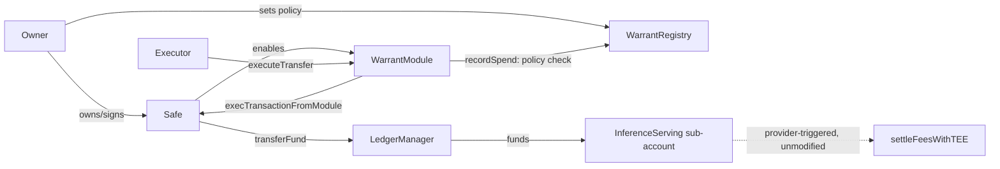

# Warrant

**An AI agent's wallet cannot fund a 0G Compute provider beyond the policy
its owner set — enforced on-chain, atomically, before the funds leave the
wallet. Live on 0G mainnet today; see "Deployments" below to verify it
yourself in under a minute.**

Warrant is an on-chain spend-authorization and audit protocol for AI agents
using 0G Compute. It enforces one boundary: an agent wallet may not fund a
0G Compute provider account beyond the policy its owner set for it, and
anyone can independently audit what was authorized against what 0G actually
settled afterward.

Warrant does not replace 0G Compute's native settlement. It controls the
single call that moves funds toward a provider —
`LedgerManager.transferFund(provider, serviceName, amount)` — and leaves
`InferenceServing.settleFeesWithTEE` exactly as 0G built it.

## What Warrant enforces

- provider allowlist
- per-warrant spend cap and remaining-budget accounting
- expiry and revocation
- that a warrant goes stale the moment its Agentic ID changes owners

## What Warrant does not, and cannot, enforce

- output quality or correctness of a compute response
- that a provider executes at all once funded
- model identity, model checkpoint, or model lineage
- anything about native settlement once funds reach a provider's sub-account

See `docs/threat-model.md` for the full boundary and `docs/bypass-analysis.md`
for every path considered and why it is either governed by Warrant or
explicitly out of scope.

## Architecture



WarrantModule's only external surface is assigning an executor and letting
that executor request a transfer; every request is checked against
WarrantRegistry before the module builds the one calldata it is capable of
building. `settleFeesWithTEE` is untouched 0G code, triggered by the
provider, not by Warrant.

## 0G components used

Integrated and load-bearing: **0G Chain** (mainnet + testnet deployment
target) and **0G Compute** — `LedgerManager`/`InferenceServing`, both the
funding boundary Warrant enforces and the settlement path its compatibility
finding investigates at source level. Not integrated in this submission:
0G Storage, 0G DA, 0G Pay, and the real Agentic ID/ERC-7857 standard —
`MockAgenticId` is a plain test-fixture ERC-721 used only to anchor a
warrant to a token owner, not an Agentic ID integration. This is a
deliberate choice of depth over breadth: a real, audited, mainnet-verified
enforcement boundary on two modules rather than shallow coverage across
five.

**A real ecosystem boundary, found and disclosed, not worked around:** 0G
Compute's current inference session authentication recovers an ECDSA
signer from a raw signature; a Safe has no private key to produce one,
confirmed by reading the provider and SDK source directly. That makes
Safe-based inference authentication incompatible with the current public
Compute flow — Warrant does not claim to control native settlement, and
this is why. See `docs/compute-compatibility-finding.md`.

## Deployments

The unmodified, audited `WarrantRegistry` and `WarrantModule` are live on
both 0G testnet (Galileo) and 0G mainnet. Full records, including every
deployment transaction hash, are version-controlled in `deployments/`.

| | Mainnet (chain 16661) | Testnet / Galileo (chain 16602) |
|---|---|---|
| `WarrantRegistry` | [`0x6bb1c3def8eFa555F59435b2F1D728BC56d6132D`](https://chainscan.0g.ai/address/0x6bb1c3def8eFa555F59435b2F1D728BC56d6132D) | [`0xbd245E37b938D459C08f1c1f6F26028FDd8A98eD`](https://chainscan-galileo.0g.ai/address/0xbd245E37b938D459C08f1c1f6F26028FDd8A98eD) |
| `WarrantModule` | [`0xd3bE7D80bF432B2B162cFbDc9B26404C9F909061`](https://chainscan.0g.ai/address/0xd3bE7D80bF432B2B162cFbDc9B26404C9F909061) | see `deployments/testnet.json` |
| Safe (agent wallet) | [`0xdBC03a74dF7540bF4bEfA662765da0f2343CC0e7`](https://chainscan.0g.ai/address/0xdBC03a74dF7540bF4bEfA662765da0f2343CC0e7) | self-deployed, see `deployments/testnet.json` |
| `LedgerManager` (0G, reused) | `0x2dE54c845Cd948B72D2e32e39586fe89607074E3` | `0xE70830508dAc0A97e6c087c75f402f9Be669E406` |

Note: mainnet and testnet use **different explorer domains** —
`chainscan.0g.ai` for mainnet, `chainscan-galileo.0g.ai` for testnet — not
the same host with a network switch. If either explorer's page appears
empty, its own indexer API confirms the data exists regardless:
`curl "https://chainscan.0g.ai/open/api?module=account&action=txlist&address=0x6bb1c3def8eFa555F59435b2F1D728BC56d6132D"`
(swap in `chainscan-galileo.0g.ai` for testnet). The commands below are the
authoritative, explorer-independent way to verify:

```
cast code 0x6bb1c3def8eFa555F59435b2F1D728BC56d6132D --rpc-url https://evmrpc.0g.ai
cast call 0xd3bE7D80bF432B2B162cFbDc9B26404C9F909061 "ledgerManager()(address)" --rpc-url https://evmrpc.0g.ai
```

The mainnet Safe and Safe/module infrastructure were exercised end-to-end
(module enabled, warrant created, executor assigned, provider-allowlist and
budget-cap enforcement checked via free `eth_call` negative tests) — see
`docs/m6-mainnet-deployment.md` for the full independently-verified
transaction-by-transaction record. No real mainnet `transferFund` has been
executed; that path is proven live on testnet only (Track A, M3) — mainnet's
`MIN_ACCOUNT_BALANCE`/`MIN_TRANSFER_AMOUNT` exceed the funded deployer's
balance, a disclosed limitation, not a gap papered over.

## Try it against real, live Galileo data right now

```
cd sdk/warrant-client
node bin/warrant-verify.js --tx 0x635cd6cca736a2df02e8734f5b8fdf6ac54fb795e83356b40207fbd28cea68d2 \
  --module 0xf47E11f9E499994C96b0C2e9ce1b7978db9416d8
```

That transaction is real — the actual Track A transfer proven live in M3.
The CLI reads it directly from 0G Galileo and reports
`AUTHORIZED_ONLY`: funded, no native settlement ever observed, exactly as
honest given the Compute compatibility finding above. Nothing here is
canned output.

## Demo frontend

`apps/web` is a Next.js product demo over the same contracts and the same
`@warrant/client` reconciliation library documented above — it adds no new
protocol behavior and reads/writes nothing this README doesn't already
describe.

```
pnpm install
pnpm --filter @warrant/web dev
```

| Route | What it does | Needs a wallet? |
|---|---|---|
| `/` | Thesis, architecture, live network status (both chains) | No |
| `/warrants` , `/warrants/[network]/[id]` | Live-read policy, budget, and a real `eth_call` policy simulator | No |
| `/verify` | Runs `@warrant/client`'s real reconciliation against any tx hash | No |
| `/activity` | Live event history per warrant, read via indexed `eth_getLogs` | No |
| `/create` | Submits two real transactions to 0G Galileo (mint a demo Agentic ID, then `createWarrant`) | **Yes** — testnet A0GI |
| `/about` | Integration scope, evidence, and boundaries, with links back into `docs/` | No |

Every other route is strictly read-only against live mainnet/testnet RPC —
no wallet, no backend, no cached data. `NEXT_PUBLIC_WALLETCONNECT_PROJECT_ID`
is optional (falls back to a placeholder; injected wallets like MetaMask
work without it) and is the only environment variable the app reads. To
deploy: `pnpm --filter @warrant/web build && pnpm --filter @warrant/web start`,
or point a platform like Vercel at `apps/web` as the project root — it
auto-detects the pnpm workspace.

## Setup — build and test everything above yourself

Requirements: [Foundry](https://getfoundry.sh) and Node.js 18+. Nothing
below needs an RPC key, a funded wallet, or a `.env` file — it all runs
against local state or offline fixtures.

```
git clone https://github.com/fourWayz/warrant.git
cd warrant
git submodule update --init --recursive   # pulls OpenZeppelin + Safe smart-account into contracts/lib

cd contracts
forge build
forge test                                # 49 tests: 46 unit + 3 invariant campaigns, 60,000 randomized calls total, zero violations

cd ../sdk/warrant-client
node --test test/*.test.js                # 21 tests, zero runtime dependencies, fully offline
```

(`npm test` runs the same command but shells out through the OS's default
script runner, which fails from a UNC-style working directory on Windows —
run `node --test test/*.test.js` directly if you hit that.)

Redeploying is not required to verify this submission — the audited
contracts are already live on both networks, see "Deployments" above — but
if you want to: `contracts/script/` holds the deploy scripts, each reading
a funded `PRIVATE_KEY` from `.env` (never committed) and the RPC endpoints
already configured in `contracts/foundry.toml`.

Network access is only needed for the live verification examples above and
the demo frontend — they hit a public 0G RPC endpoint, no API key required.

## Evidence labeling

Used consistently across this README and `docs/`:

| Label | Means |
|---|---|
| **LIVE / VERIFIED ON 0G** | Read directly from Galileo via a real RPC call |
| **VERIFIED AGAINST SOURCE** | Confirmed against 0G's actual deployed contract source/ABI or a captured real transaction |
| **SYNTHETIC TEST FIXTURE** | Constructed for testing, always disclosed as such in the fixture itself |
| **NOT CURRENTLY PROVABLE** | Not observable from any event or contract 0G exposes today |
| **FUTURE EXTENSION** | Deliberately not built yet |

## Repository layout

```
contracts/     Foundry project — WarrantRegistry, WarrantModule, invariant fuzz suite, deploy scripts
sdk/           warrant-client: dependency-free reconciliation library + CLI verifier (M4/M5)
apps/web       Next.js product demo over the contracts + SDK above — see "Demo frontend" above
apps/explorer  Public, read-only verifier (FUTURE EXTENSION, unbuilt)
services/indexer  Log-decoding helper for the explorer (FUTURE EXTENSION, unbuilt)
docs/          Threat model, bypass analysis, design notes
deployments/   Version-controlled record of every deployed address, per chain
```

## Status

M0–M6 complete: `WarrantRegistry`/`WarrantModule` implemented and
adversarially tested (M0–M2, 46 unit tests); the security boundary proven
live on 0G Galileo alongside the source-traced Compute authentication
finding above (M3, `docs/m3-tracks.md`, `docs/compute-compatibility-finding.md`);
a read-only settlement-reconciliation library (M4, `docs/m4-reconciliation.md`);
a CLI verifier and a 60,000-call invariant fuzz suite with zero violations
(M5, `docs/m5-verifier.md`); and deployment of the same, unmodified
contracts to 0G mainnet with independent re-verification (M6,
`docs/m6-mainnet-deployment.md`).

Nothing built after M3 widened what Warrant claims — M4 and M5 made an
existing claim easier to verify, M6 moved it onto real mainnet
infrastructure. 0G DA, 0G Storage, ERC-8004, a real Agentic ID/ERC-7857
integration, a hosted explorer, and any Warrant policy extension remain
deliberately out of scope — see "What M4 explicitly does not do" in
`docs/m4-reconciliation.md` for why each was considered and set aside.
