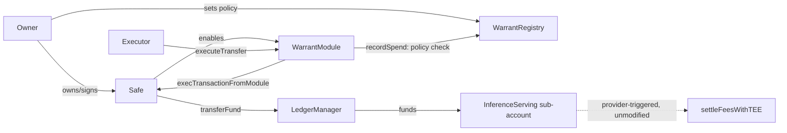

# Warrant

**An AI agent's wallet cannot fund a 0G Compute provider beyond the policy
its owner set — enforced on-chain, atomically, before the funds leave the
wallet. Live on 0G mainnet today; see "Deployments" below to verify it
yourself in under a minute.**

Warrant is an on-chain spend-authorization and audit protocol for AI agents
using 0G Compute. It enforces one boundary: an agent wallet may not fund a
0G Compute provider account beyond the policy its owner set for it, and
anyone can independently audit what was authorized against what 0G actually
settled afterward.

Warrant does not replace 0G Compute's native settlement. It controls the
single call that moves funds toward a provider —
`LedgerManager.transferFund(provider, serviceName, amount)` — and leaves
`InferenceServing.settleFeesWithTEE` exactly as 0G built it.

## What Warrant enforces

- provider allowlist
- per-warrant spend cap and remaining-budget accounting
- expiry and revocation
- that a warrant goes stale the moment its Agentic ID changes owners

## What Warrant does not, and cannot, enforce

- output quality or correctness of a compute response
- that a provider executes at all once funded
- model identity, model checkpoint, or model lineage
- anything about native settlement once funds reach a provider's sub-account

See `docs/threat-model.md` for the full boundary and `docs/bypass-analysis.md`
for every path considered and why it is either governed by Warrant or
explicitly out of scope.

## Architecture



WarrantModule's only external surface is assigning an executor and letting
that executor request a transfer; every request is checked against
WarrantRegistry before the module builds the one calldata it is capable of
building. `settleFeesWithTEE` is untouched 0G code, triggered by the
provider, not by Warrant.

## 0G components used

Integrated and load-bearing: **0G Chain** (mainnet + testnet deployment
target) and **0G Compute** — `LedgerManager`/`InferenceServing`, both the
funding boundary Warrant enforces and the settlement path its compatibility
finding investigates at source level. Not integrated in this submission:
0G Storage, 0G DA, 0G Pay, and the real Agentic ID/ERC-7857 standard —
`MockAgenticId` is a plain test-fixture ERC-721 used only to anchor a
warrant to a token owner, not an Agentic ID integration. This is a
deliberate choice of depth over breadth: a real, audited, mainnet-verified
enforcement boundary on two modules rather than shallow coverage across
five.

## Setup

Requirements: [Foundry](https://getfoundry.sh) and Node.js 18+. Nothing
below needs an RPC key, a funded wallet, or a `.env` file — it all runs
against local state or offline fixtures.

```
git clone https://github.com/fourWayz/warrant.git
cd warrant
git submodule update --init --recursive   # pulls OpenZeppelin + Safe smart-account into contracts/lib

cd contracts
forge build
forge test                                # 49 tests: 46 unit + 3 invariant campaigns, 60,000 randomized calls total, zero violations

cd ../sdk/warrant-client
node --test test/*.test.js                # 21 tests, zero runtime dependencies, fully offline
```

(`npm test` runs the same command but shells out through the OS's default
script runner, which fails from a UNC-style working directory on Windows —
run `node --test test/*.test.js` directly if you hit that.)

Redeploying is not required to verify this submission — the audited
contracts are already live on both networks, see "Deployments" below —
but if you want to: `contracts/script/` holds the deploy scripts, each
reading a funded `PRIVATE_KEY` from `.env` (never committed) and the
RPC endpoints already configured in `contracts/foundry.toml`.

Network access is only needed for the live verification examples below —
they hit a public 0G RPC endpoint, no API key required.

## Try it against real, live Galileo data right now

```
cd sdk/warrant-client
node bin/warrant-verify.js --tx 0x635cd6cca736a2df02e8734f5b8fdf6ac54fb795e83356b40207fbd28cea68d2 \
  --module 0xf47E11f9E499994C96b0C2e9ce1b7978db9416d8
```

That transaction is real — the actual Track A transfer proven live in M3.
The CLI reads it directly from 0G Galileo and reports
`AUTHORIZED_ONLY`: funded, no native settlement ever observed, exactly as
honest given the Compute compatibility finding below. Nothing here is
canned output.

## Deployments

The unmodified, audited `WarrantRegistry` and `WarrantModule` are live on
both 0G testnet (Galileo) and 0G mainnet. Full records, including every
deployment transaction hash, are version-controlled in `deployments/`.

| | Mainnet (chain 16661) | Testnet / Galileo (chain 16602) |
|---|---|---|
| `WarrantRegistry` | [`0x6bb1c3def8eFa555F59435b2F1D728BC56d6132D`](https://chainscan.0g.ai/address/0x6bb1c3def8eFa555F59435b2F1D728BC56d6132D) | [`0xbd245E37b938D459C08f1c1f6F26028FDd8A98eD`](https://chainscan-galileo.0g.ai/address/0xbd245E37b938D459C08f1c1f6F26028FDd8A98eD) |
| `WarrantModule` | [`0xd3bE7D80bF432B2B162cFbDc9B26404C9F909061`](https://chainscan.0g.ai/address/0xd3bE7D80bF432B2B162cFbDc9B26404C9F909061) | see `deployments/testnet.json` |
| Safe (agent wallet) | [`0xdBC03a74dF7540bF4bEfA662765da0f2343CC0e7`](https://chainscan.0g.ai/address/0xdBC03a74dF7540bF4bEfA662765da0f2343CC0e7) | self-deployed, see `deployments/testnet.json` |
| `LedgerManager` (0G, reused) | `0x2dE54c845Cd948B72D2e32e39586fe89607074E3` | `0xE70830508dAc0A97e6c087c75f402f9Be669E406` |

Note: mainnet and testnet use **different explorer domains** —
`chainscan.0g.ai` for mainnet, `chainscan-galileo.0g.ai` for testnet — not
the same host with a network switch. If either explorer's page appears
empty, its own indexer API confirms the data exists regardless:
`curl "https://chainscan.0g.ai/open/api?module=account&action=txlist&address=0x6bb1c3def8eFa555F59435b2F1D728BC56d6132D"`
(swap in `chainscan-galileo.0g.ai` for testnet). The commands below are the
authoritative, explorer-independent way to verify:

```
cast code 0x6bb1c3def8eFa555F59435b2F1D728BC56d6132D --rpc-url https://evmrpc.0g.ai
cast call 0xd3bE7D80bF432B2B162cFbDc9B26404C9F909061 "ledgerManager()(address)" --rpc-url https://evmrpc.0g.ai
```

The mainnet Safe and Safe/module infrastructure were exercised end-to-end
(module enabled, warrant created, executor assigned, provider-allowlist and
budget-cap enforcement checked via free `eth_call` negative tests) — see
`docs/m6-mainnet-deployment.md` for the full independently-verified
transaction-by-transaction record. No real mainnet `transferFund` has been
executed; that path is proven live on testnet only (Track A, M3) — mainnet's
`MIN_ACCOUNT_BALANCE`/`MIN_TRANSFER_AMOUNT` exceed the funded deployer's
balance, a disclosed limitation, not a gap papered over.

## Evidence labeling

Used consistently across this README and `docs/`:

| Label | Means |
|---|---|
| **LIVE / VERIFIED ON 0G** | Read directly from Galileo via a real RPC call |
| **VERIFIED AGAINST SOURCE** | Confirmed against 0G's actual deployed contract source/ABI or a captured real transaction |
| **SYNTHETIC TEST FIXTURE** | Constructed for testing, always disclosed as such in the fixture itself |
| **NOT CURRENTLY PROVABLE** | Not observable from any event or contract 0G exposes today |
| **FUTURE EXTENSION** | Deliberately not built yet |

## Repository layout

```
contracts/     Foundry project — WarrantRegistry, WarrantModule, invariant fuzz suite, deploy scripts
sdk/           warrant-client: dependency-free reconciliation library + CLI verifier (M4/M5)
apps/explorer  Public, read-only verifier (FUTURE EXTENSION)
services/indexer  Log-decoding helper for the explorer (FUTURE EXTENSION)
docs/          Threat model, bypass analysis, design notes
deployments/   Version-controlled record of every deployed address, per chain
```

## Status

M0–M6 complete. M0–M2: repository scaffold, testnet infrastructure,
`WarrantRegistry`, `WarrantModule`, and the adversarial test suite (46
tests). M3: Warrant's core security boundary proven live on real 0G Galileo
contracts (see `docs/m3-tracks.md`), and a compatibility investigation into
0G Compute's own request/settlement flow (see
`docs/compute-compatibility-finding.md`). M4: the read-only reconciliation
layer (`sdk/warrant-client`) that correlates a Warrant-authorized transfer
against native 0G settlement events — see `docs/m4-reconciliation.md`. M5:
a CLI verifier over that same library, warrant-level (not just
single-transfer) reconciliation, and a property-based fuzz suite proving
the spend-cap and allowlist invariants across 60,000 randomized calls (three
invariants, reproducible via `forge test`) with zero violations — see
`docs/m5-verifier.md`. M6: the same, unmodified
`WarrantRegistry` and `WarrantModule` deployed to real 0G mainnet, reusing
mainnet's own live Safe and 0G Compute infrastructure rather than
redeploying it, with every claim independently re-verified against the
chain itself — see `docs/m6-mainnet-deployment.md`.

**M3 conclusion:** Warrant's core security boundary is proven on real 0G
infrastructure — a Safe-controlled agent cannot authorize provider funding
outside its owner-defined Warrant policy. 0G Compute's current inference
authentication requires the funded account itself to possess an ECDSA
private key, making Safe-based inference authentication incompatible with
the current public Compute flow. Warrant does not claim to control native
Compute settlement; the incompatibility is documented as an ecosystem
integration boundary, not hidden or worked around.

**M4 conclusion:** Warrant verifies authorization and settlement
correlation. It does not verify compute quality. The reconciliation layer
never moves funds, never alters policy, and its own failure or absence
cannot weaken anything M1–M3 already proved — see
`docs/m4-reconciliation.md` for the authorized/funded/settled/correlated
distinction this rests on.

**M5 conclusion:** the audit half of Warrant's thesis is now something
anyone can run themselves, against real Galileo data, without trusting a
backend — and the enforcement half has been checked against 60,000
randomized adversarial call sequences, not just the cases written by hand.
Neither changes what Warrant claims; both make the existing claims easier
to verify and harder to doubt. See `docs/m5-verifier.md`.

**M6 conclusion:** deployment to mainnet added no new trust surface — same
contracts, same invariants, same claim boundary as M0–M5. What changed is
that the boundary now stands on real 0G mainnet infrastructure, verified
independently of the deployment tooling itself. A real mainnet funding
transaction remains unexecuted, disclosed as a limitation rather than
implied; see `docs/m6-mainnet-deployment.md` for why.

0G DA, deeper ERC-7857 integration, ERC-8004 interop, a hosted public
explorer, a real 0G Storage uploader, and any Warrant extension (delegated
capability graphs, fine-tune lineage, provider bonding) remain future
extensions, not started — see the M4 architecture reassessment for why
each was deferred or rejected.
